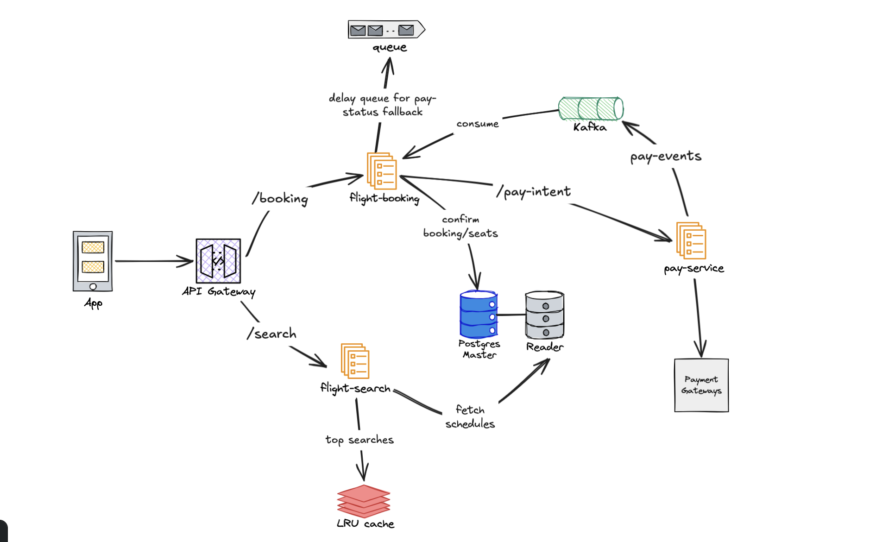

# Flight Booking System

A multi-module Spring Boot application in Kotlin for managing flight bookings and searches.

Architecture diagram:


## 🚀 How to Run

### 1. Start Infrastructure
Run the following command from the project root:
```bash
docker-compose -f docker/docker-compose.yml up -d
```
This starts:
- PostgreSQL (5432)
- Redis Booking (6379)
- Redis Searching (6380)
- RabbitMQ (5672, 15672)
- Kafka (9092)
- WireMock (8081)

### 2. Generate JOOQ Code
```bash
./gradlew :common:jooqCodegen
```

### 3. Run Services
Start the services in separate terminals:

**Flight Booking Service:**
```bash
./gradlew :flight-booking:bootRun
```
- API: http://localhost:8080/v1/booking

**Flight Searching Service:**
```bash
./gradlew :flight-searching:bootRun
```
- API: http://localhost:8082/v1/search-flights

## 🧪 Testing

### Flight Booking & Reconciliation Testing
The system handles race conditions between Kafka events and RabbitMQ polling. WireMock is configured to simulate network delays and multi-stage polling states.

**Scenario 1: Poller Handles Finalization (Kafka Failure Simulation)**
If Kafka fails to deliver the event, the RabbitMQ poller acts as a reliable fallback.
1. Create a booking:
```bash
curl -X POST http://localhost:8080/v1/booking \
  -H "Content-Type: application/json" \
  -d '{"userId": "00000000-0000-0000-0000-000000000001", "scheduleId": "a1111111-1111-1111-1111-111111111111", "seatIds": ["f1000000-0000-0000-0000-000000000001"]}'
```
2. **Watch the logs**: The initial payment will timeout, retry, and then succeed.
3. **The Poller**: The RabbitMQ poller will check the status 3 times (1 min apart). The first two polls return `INITIATED`, and the 3rd poll returns `SUCCESS`, successfully confirming the booking.

**Scenario 2: Kafka Handles Finalization (Early Exit Simulation)**
To prove the Kafka listener safely updates the database and cancels the RabbitMQ poller:
1. Create a booking using the same `curl` command above.
2. Quickly copy the `bookingId` and `payId` from the application logs.
3. Simulate a fast Kafka event using the Internal Test API (run this before the 3rd minute of polling):
```bash
curl -X POST http://localhost:8080/internal/kafka/payment-event \
  -H "Content-Type: application/json" \
  -d '{"bookingId": "YOUR_BOOKING_ID", "payId": "YOUR_PAY_ID", "status": "SUCCESS"}'
```
4. **Watch the logs**: The `PaymentListener` (Kafka) will immediately confirm the booking.
5. **Early Exit**: When the RabbitMQ poller wakes up on its next cycle, you will see a log stating it skipped the poll because the booking was already finalized.


### Flight Searching Service (LRU Cache Eviction)
The local database is seeded with 6 flight routes starting 2026-04-25. The LRU cache limit is set to **3**. 
To test the hit/miss/eviction logic, watch the application logs and execute these commands sequentially (assuming the date is YYYY-MM-DD):

1. **Miss -> Cache Size 1**
```bash
curl "http://localhost:8082/v1/search-flights?source=DEL&dest=BOM&date=$(date -v+1d +%Y-%m-%d)"
```

2. **Miss -> Cache Size 2**
```bash
curl "http://localhost:8082/v1/search-flights?source=BOM&dest=BLR&date=$(date -v+1d +%Y-%m-%d)"
```

3. **Miss -> Cache Size 3 (Cache is now Full)**
```bash
curl "http://localhost:8082/v1/search-flights?source=DEL&dest=BLR&date=$(date -v+1d +%Y-%m-%d)"
```

4. **Hit -> MRU Updated** (DEL->BOM becomes newest, pushing BOM->BLR to oldest)
```bash
curl "http://localhost:8082/v1/search-flights?source=DEL&dest=BOM&date=$(date -v+1d +%Y-%m-%d)"
```

5. **Miss -> Eviction!** (Limit exceeded. The oldest query, `BOM->BLR`, is deleted from Redis)
```bash
curl "http://localhost:8082/v1/search-flights?source=BLR&dest=MAA&date=$(date -v+1d +%Y-%m-%d)"
```

